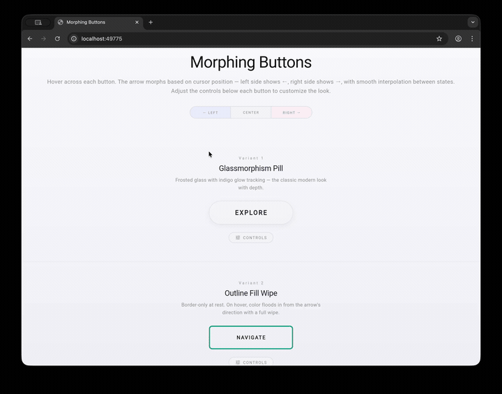

# Morphing Button

A Flutter package providing morphing button widgets with smooth directional arrow animations that respond to cursor position.

Hover across each button — the arrow morphs based on where your cursor is. Left side shows ←, right side shows →, with smooth interpolation between states.



## Features

- **Cursor-aware animation** — arrow direction and visual effects respond to horizontal cursor position in real time
- **Smooth interpolation** — all transitions use per-frame exponential ease-out for fluid motion
- **Touch support** — drag across buttons on mobile/tablet to see the same morphing effect
- **4 built-in variants** — each with a distinct visual personality
- **Fully configurable** — font size, padding, letter spacing, arrow size, and variant-specific properties are all adjustable

## Variants

| # | Name | Style |
|---|------|-------|
| 1 | **Glassmorphism Pill** | Frosted glass with indigo glow tracking |
| 2 | **Outline Fill Wipe** | Border-only at rest, color floods in on hover |
| 3 | **Soft Shadow Float** | White card that lifts with colored shadow |
| 4 | **Underline Editorial** | Typography-first with sweeping underline |

## Getting Started

Add the dependency to your `pubspec.yaml`:

```yaml
dependencies:
  morphing_button:
    git:
      url: https://github.com/user/morphing_button.git
```

Then import and use:

```dart
import 'package:morphing_button/morphing_button.dart';

// Simple usage
GlassPillButton(label: 'EXPLORE')

// With configuration
OutlineFillButton(
  label: 'NAVIGATE',
  borderRadius: 8,
  borderWidth: 2,
  fillOpacity: 0.9,
  fontSize: 14,
  onTap: () => print('tapped'),
)
```

## Usage

### GlassPillButton

```dart
GlassPillButton(
  label: 'EXPLORE',
  fontSize: 13,
  letterSpacing: 2.5,
  horizontalPadding: 52,
  verticalPadding: 16,
  arrowSize: 10,
  arrowStrokeWidth: 2.0,
  onTap: () {},
)
```

### OutlineFillButton

```dart
OutlineFillButton(
  label: 'NAVIGATE',
  borderRadius: 0,       // square corners by default
  borderWidth: 2,
  fillOpacity: 0.92,     // color fill wipe opacity
  fontSize: 13,
  letterSpacing: 2,
  onTap: () {},
)
```

### SoftShadowButton

```dart
SoftShadowButton(
  label: 'DISCOVER',
  shadowBlur: 28,        // colored shadow blur radius
  elevation: 2,          // hover lift amount
  fontSize: 14,
  letterSpacing: 1.5,
  onTap: () {},
)
```

### UnderlineMinimalButton

```dart
UnderlineMinimalButton(
  label: 'CONTINUE',
  underlineHeight: 1.5,  // underline thickness
  fontSize: 13,
  letterSpacing: 3,
  onTap: () {},
)
```

## Shared Parameters

All variants inherit these configurable properties from `MorphingButtonBase`:

| Parameter | Type | Default | Description |
|-----------|------|---------|-------------|
| `label` | `String` | required | Button text |
| `onTap` | `VoidCallback?` | `null` | Tap callback |
| `fontSize` | `double` | `13` | Label font size |
| `letterSpacing` | `double` | `2` | Label letter spacing |
| `horizontalPadding` | `double` | `48` | Horizontal padding |
| `verticalPadding` | `double` | `16` | Vertical padding |
| `arrowSize` | `double` | `8` | Arrow head size |
| `arrowStrokeWidth` | `double` | `2.5` | Arrow line thickness |

> Note: Some variants override these defaults (e.g., GlassPillButton uses `letterSpacing: 2.5` by default).

## How It Works

Each button tracks the cursor's horizontal position as a ratio (0.0–1.0) across the widget. Two smoothly animated values drive the visuals:

- **ratio** — cursor X position, smoothly interpolated per frame
- **presence** — 0.0 when not hovered, 1.0 when hovered, smoothly animated

A `dirFromRatio()` function maps the ratio to a directional value with a dead zone in the center:
- Left third → arrow points left
- Center third → neutral (no arrow)
- Right third → arrow points right

## Running the Example

```bash
cd example
flutter run -d macos   # or chrome, windows, linux
```

The example app is an interactive playground where you can hover over each variant and tweak all parameters with live controls.

## License

MIT License — see [LICENSE](LICENSE) for details.
